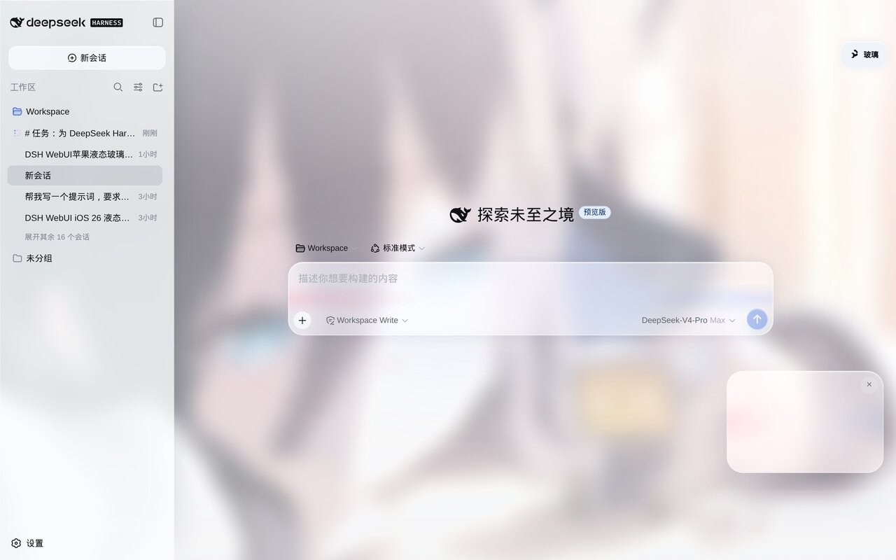
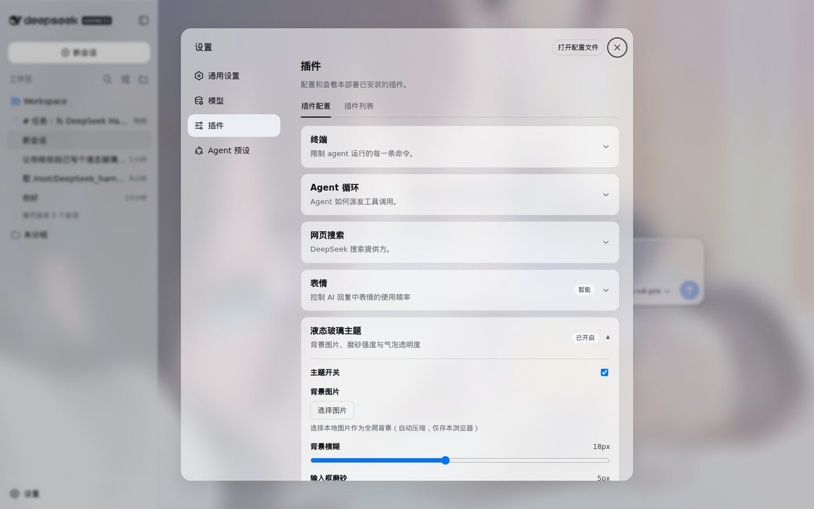
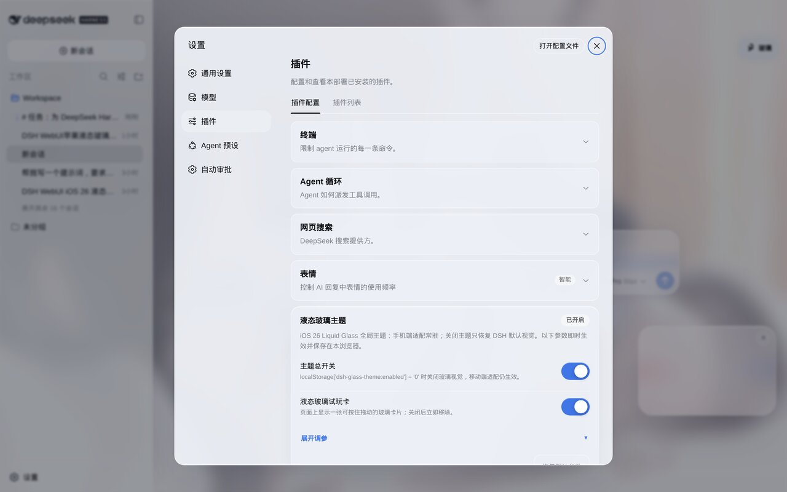

# dsh-glassmorphism

DeepSeek Harness（DSH）WebUI 的 **玻璃质感（Glassmorphism）主题**，并包含**常驻手机端 UI 适配**。

- 手机端适配与玻璃主题解耦：`localStorage['dsh-glass-theme:enabled'] = '0'` 只关闭玻璃视觉，单栏聊天、抽屉侧边栏、详情 Sheet、安全区、44px 触控目标仍然生效。
- **玻璃渲染方式参考 [`xingyingyuzhui/dsh-liquid-glass`](https://github.com/xingyingyuzhui/dsh-liquid-glass)**：独立壁纸层保持清晰，侧栏 / 标题 / 输入卡 / 弹层各画玻璃岛（`::before` + 局部 `backdrop-filter`），折射用 **SDF 位移透镜**（按岛实际尺寸生成圆角盒位移贴图，经 `feImage + feDisplacementMap` 注入 SVG 滤镜，RGB 通道分离产生色散）。
- 输入卡折射开关独立：`data-dsh-glass-lens` + `data-dsh-glass-refract`，只作用 backdrop，不位移输入文字。
- 背景插画（`assets/background.jpg`）在构建时内联为 data URL，作为壁纸层（不整图模糊），透明度可调。

## 截图预览

| 主界面 | 主题设置 |
| --- | --- |
|  |  |

| 插件列表 | 输入框近景 |
| --- | --- |
|  |  |

## 一、安装（web profile）

```bash
git clone https://github.com/czw63/dsh-glassmorphism.git
cd dsh-glassmorphism
node scripts/build.mjs   # 把 assets/background.jpg 内联进 lib/client.js

dsh plugin --profile web add "file:$(pwd)"
```

仓库自带 `cordis.patch.yml`（`dsh.bundle.patch`），`dsh plugin add` 时自动把 `glass-theme` 挂载进 bundle layer，**无需手动改 profile 的 cordis.patch.yml**。

重启并强刷：

```bash
systemctl restart dsh.service
# 浏览器打开 http://127.0.0.1:3080/ 后 Ctrl+F5
```

验证注入：

```bash
curl -s http://127.0.0.1:3080/ | grep -o '/plugins/@local/dsh-glass-theme/client.js[^"]*'
```

> 注意：pnpm `file:` 安装会把包**拷贝**到 profile 的 `node_modules`。**改完源码后必须重新执行
> `node scripts/build.mjs`，并重新 `dsh plugin --profile web add "file:$(pwd)"`（或手动把 `lib/client.js`
> 同步到 profile 的 `node_modules/@local/dsh-glass-theme/lib/client.js`），然后重启服务。

## 二、卸载

```bash
dsh plugin --profile web remove @local/dsh-glass-theme
```

并从 `cordis.patch.yml` 删除 `glass-theme` 的 `insert` 块，然后：

```bash
systemctl restart dsh.service
```

浏览器强刷后恢复 DSH 默认外观与桌面/手机默认布局。

## 三、开关与调参

### 1. 设置页开关

打开 DSH 设置 → 插件 → **液态玻璃主题**：

- **主题总开关**：关闭后恢复 DSH 默认视觉；手机端布局适配不受影响。
- **输入框液态折射**：输入卡的 SDF 位移折射开关（仅作用于 backdrop，不位移输入文字）。移动端此开关仍保留基础玻璃卡片，但自动去除气泡磨砂。

### 2. localStorage

```js
localStorage['dsh-glass-theme:enabled'] = '0'   // 关闭玻璃视觉（手机适配仍在）
localStorage['dsh-glass-theme:input-lens'] = '0' // 关闭输入框液态折射
```

跨标签页实时同步。

### 3. `--glass-*` CSS 变量

所有视觉参数都暴露为 CSS 变量，可在 DevTools 或 `localStorage['dsh-glass-theme:vars']` 中覆盖，例如：

```js
// 持久化覆盖
localStorage.setItem('dsh-glass-theme:vars', JSON.stringify({
  '--glass-bg-blur': '24px',
  '--glass-base-alpha': '.52',
  '--glass-input-alpha': '.40',
  '--glass-radius-xl': '28px'
}));
location.reload();
```

常用变量：

| 变量 | 默认（浅/深） | 说明 |
| --- | --- | --- |
| `--glass-bg-blur` | 16px / 18px | 侧栏/标题等玻璃岛的 backdrop 模糊 |
| `--glass-bg-saturate` | .78 / .82 | 玻璃岛饱和度 |
| `--glass-bg-brightness` | 1.04 / .62 | 背景亮度 |
| `--glass-wallpaper-opacity` | .92 / .90 | 壁纸层不透明度 |
| `--glass-radius-xl` | 28px | 玻璃岛圆角（同时驱动 SDF 透镜轮廓） |
| `--glass-radius-lg` | 22px | 小岛/卡片圆角 |
| `--glass-sidebar-alpha` | .52 / .58 | 侧边栏透明度 |
| `--glass-input-alpha` | .48 / .34 | 输入卡透明度 |
| `--glass-bubble-alpha` | .86 / .84 | 消息气泡透明度（无下限，可在设置页滑到 0） |
| `--glass-popover-alpha` | .93 / .94 | 弹层/菜单透明度 |
| `--glass-popover-blur` | 18px | 弹层 backdrop 模糊 |
| `--glass-input-blur` | 12px | 输入框 backdrop 模糊 |
| `--glass-highlight` | 白 .72 / 白 .30 | 顶部内高光强度 |

也可用控制台 API：

```js
window.__dshGlassTheme.enabled();               // 查询玻璃视觉是否开启（返回 boolean）
window.__dshGlassTheme.on();                    // 开
window.__dshGlassTheme.off();                   // 关（仅玻璃）
window.__dshGlassTheme.toggle();                // 切换
window.__dshGlassTheme.lensOn();                // 开输入框折射
window.__dshGlassTheme.lensOff();               // 关输入框折射
window.__dshGlassTheme.setVar('--glass-bg-blur', '20px');
window.__dshGlassTheme.clearVars();
window.__dshGlassTheme.reapply();
```

## 四、手机端适配（始终生效）

`<= 768px` 时：

- `.pI_x6G_frame` 强制单栏；侧边栏成为左侧抽屉（86vw / 360px 封顶），通过汉堡按钮或 DSH 原生侧边栏开关打开，点遮罩关闭。
- 详情栏成为全屏底部 Sheet，点遮罩或原生「关闭详情」按钮收起。
- 拖拽手柄 `.pI_x6G_handle` 隐藏。
- 顶部/底部使用 `env(safe-area-inset-*)`；高度使用 `100dvh` 并在运行时跟随 `visualViewport`，软键盘弹出时输入框仍可见。
- 常用按钮、菜单项最小触控高度 44px；聊天消息、设置页、菜单不产生横向滚动。
- 设置页改为手机全屏面板，左侧导航变顶部横向导航。
- 桌面 `>= 1024px` 不受影响；`768–1024px` 保持 DSH 原生窄屏行为，仅补充安全区与通用触控修正。

## 五、实现说明（升级维护）

- 主题不修改 DSH 源码，只注入 3 个 `<style>` 节点：
  - `data-plugin="dsh-glass-theme-mobile"`：移动端布局，常驻。
  - `data-plugin="dsh-glass-theme-controls"`：汉堡/开关/遮罩/设置卡片。
  - `data-plugin="dsh-glass-theme"`：玻璃视觉，随开关插入/移除。
- 依赖的稳定接口：`body[data-ds-dark-theme]`、`--dsw-*` token、`.pI_x6G_frame[data-sidebar-collapsed][data-details-collapsed]`、`.wSkVaW_*`、`.uV2eYG_*`、`.ydkMvW_*`、`.VOzbGW_*`。DSH 升级后若类名变化，优先检查这些选择器。
- **玻璃渲染方式参考 [`xingyingyuzhui/dsh-liquid-glass`](https://github.com/xingyingyuzhui/dsh-liquid-glass)**：壁纸层保持清晰；侧栏 / 标题 / 输入卡 / 弹层各画玻璃岛（`::before` + 局部 `backdrop-filter`）；折射用 SDF 位移透镜（按岛实际尺寸生成圆角盒位移贴图 → `feImage + feDisplacementMap`，RGB 通道分离产生色散），参数由设置滑杆驱动（折射强度 / 圆角），相同尺寸 + 参数命中缓存；移动端与 `prefers-reduced-motion` 自动降级。

## 六、性能

- 壁纸层静态（不整图模糊）；玻璃模糊只发生在各玻璃岛 `::before`，不糊壁纸、body 或官方滚动容器。
- `backdrop-filter` 仅用于侧栏 / 标题 / 输入卡 / 弹层 / 气泡（桌面端）等中小面积。
- SDF 位移贴图按需生成（尺寸或参数变化时），同尺寸 + 同参数命中缓存；无逐帧动画、无滚动轮询；`prefers-reduced-motion` 全部关闭。

## 七、贡献

欢迎提交 issue 与 PR。约定：

- 渲染逻辑集中在 `lib/client.template.js`；改动后必须执行 `node scripts/build.mjs` 重新生成 `lib/client.js`，并按上文说明同步到 profile 的 `node_modules`。
- 新增或调整手机端布局、玻璃视觉、设置页参数时，请同步更新 `CHANGELOG.md` 与 `docs/`（`ARCHITECTURE.md`、`TUNING.md`、`MOBILE.md`）。
- 保持零第三方运行时依赖；确认 `prefers-reduced-motion` 与移动端降级仍然生效。
- 文档统一使用简体中文。

更多实现细节见 [`docs/ARCHITECTURE.md`](docs/ARCHITECTURE.md)，调参见 [`docs/TUNING.md`](docs/TUNING.md)，手机端适配见 [`docs/MOBILE.md`](docs/MOBILE.md)。
