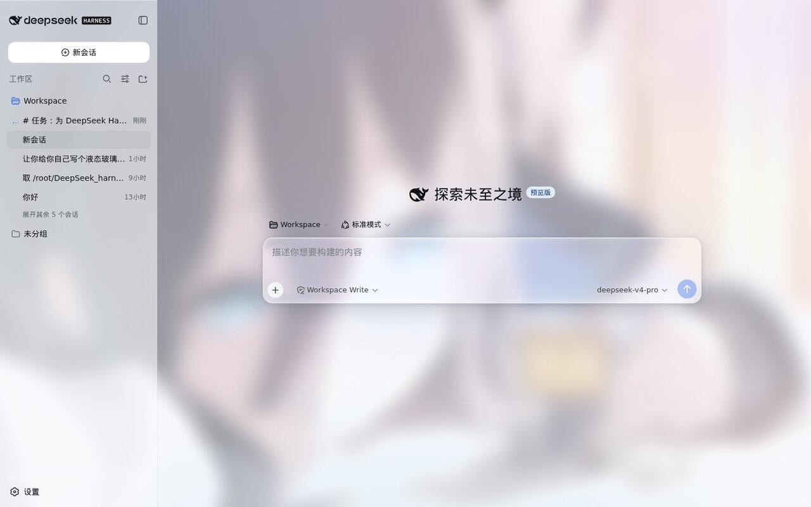
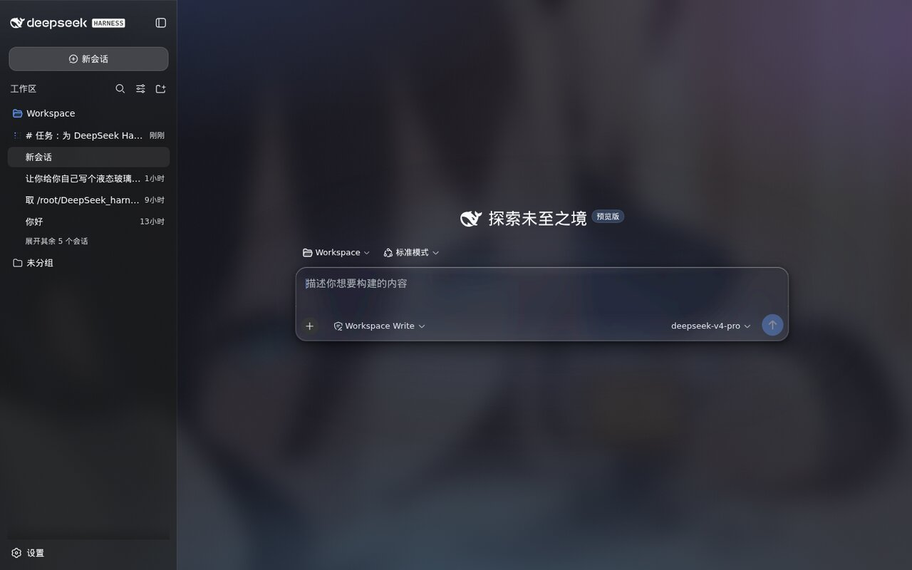

# dsh-glass-theme

给 [DeepSeek Harness](https://github.com/deepseek-ai/DeepSeek-Harness) WebUI（`dsh web`）的 **iOS 26 Liquid Glass（液态玻璃）** 全局主题。

以明亮插画作为全局背景透出，侧边栏 / 主区 / 详情栏 / 输入区 / 气泡 / 弹层形成清晰的分层玻璃质感；自动适配深浅色，内置可视化设置卡片，可一键开关、恢复默认外观。

> 纯 CSS 注入 + 一个静态噪点层 + 一个小面积折射 SVG。**零第三方依赖、零运行时动画、零滚动监听**，性能优先。

## 效果预览

| 浅色 | 深色 | 设置卡片 |
| --- | --- | --- |
|  |  |  |

## 特性

- **全局玻璃层级**：背景插画（柔化 + 蒙层）→ 侧边栏 → 详情栏 → 主区 → 输入卡片 → 用户气泡（半透明玻璃）→ 弹层（折射感最强）。
- **性能优先**：
  - 背景插画放 `body::before` 固定层，**一次性静态 `blur()+saturate()+brightness()` 合成**（GPU 合成一次，滚动/交互零成本）；
  - 面板只做**半透明**（`color-mix` 静态值，alpha 混合是合成器基本操作）；
  - `backdrop-filter` 实时模糊**只用于弹层/菜单/气泡/输入卡片**（中/小面积）；侧边栏/详情栏/主区用纯半透明（避免 backdrop-filter 创建 containing block 困住内部 fixed 弹层）；
  - 无 JS 动画、无滚动/resize 监听、无装饰性循环动画。
- **可读性保障**：文字 token 一概不动；用户气泡默认 65% 不透明度（0–100% 可调）、代码块保持默认不透明；选区/焦点环清晰。
- **可视化设置卡片**：主题开关、背景图片、背景模糊、输入框磨砂、用户气泡透明度、侧边栏透明度、面板圆角、磨砂颗粒（强度/大小），实时生效、可恢复默认。
- **随时开关**：`localStorage['dsh-glass-theme:enabled'] = '0'` 关闭（恢复 DSH 默认外观），跨标签页实时同步。
- **降级兜底**：`prefers-reduced-motion` 关闭过渡；`@supports` 对不支持 `color-mix` / `backdrop-filter` 的浏览器降级为不透明原色。

## 目录结构

```
dsh-glass-theme/
├── package.json            # dsh.client 声明（web 平台、立即注入）
├── lib/
│   ├── index.js            # server 端：注册 /glass-assets 同源静态路由（发图通道）
│   ├── client.template.js  # 浏览器端模板（可读源码，含背景图占位符 __GLASS_BG_DATA_URL__）
│   └── client.js           # 构建产物（含背景图 data URL，DSH 直接服务此文件）
├── assets/
│   └── background.jpg      # 内置背景图源（替换后重新构建即可换背景）
├── serve/                  # 发图通道静态目录（挂到 /glass-assets，图片不入库）
├── docs/
│   ├── IMAGE-CHANNEL.md    # 发图通道说明
│   └── screenshots/        # 展示截图
└── scripts/
    ├── build.mjs           # 构建：assets/background.jpg → lib/client.js
    ├── deploy.sh           # 一键部署（ensure-links + build + 重启 + 验证）
    └── ensure-links.sh     # symlink 自愈（幂等）
```

## 安装

### 1. 安装包

```bash
# 等价 pnpm add，把包链接进 ~/.dsh/profiles/web/node_modules/@local/dsh-glass-theme/
dsh plugin --profile web add "file:/绝对路径/dsh-glass-theme"
```

### 2. 注册插件

在 `~/.dsh/profiles/web/cordis.patch.yml` 末尾追加：

```yaml
- insert:
    - id: glass-theme
      name: '@local/dsh-glass-theme'
```

### 3. 重启并强刷

```bash
systemctl restart dsh.service   # 或你启动 dsh web 的方式
```

浏览器 **Ctrl+F5** 强刷后，页面源码的 `window.__DSH_BOOT__` 里应出现
`/plugins/@local/dsh-glass-theme/client.js`。

## 使用

### 开关

- **图形化**：设置 → 插件 → 液态玻璃主题 → 主题开关。
- **控制台**：
  - 关闭：`localStorage['dsh-glass-theme:enabled'] = '0'`，刷新；
  - 开启：`localStorage.removeItem('dsh-glass-theme:enabled')`，刷新。
- **JS API**（浏览器控制台）：`window.__dshGlassTheme.on()` / `.off()` / `.reapply()` / `.enabled()`。

### 自定义设置（设置卡片）

打开「设置 → 插件 → 液态玻璃主题」，点卡片标题展开。所有改动实时生效，存 `localStorage['dsh-glass-theme:settings']`，跨标签页同步，「恢复默认」一键还原。

| 选项 | 范围 | 默认 | 说明 |
| --- | --- | --- | --- |
| 主题开关 | 开/关 | 开 | 关闭后恢复 DSH 默认外观 |
| 背景图片 | 本地图片 | 内置插画 | 自动压缩（≤1920px、JPEG），仅存本浏览器；「恢复默认」还原内置图 |
| 背景模糊 | 0–40 px | 18 | 背景静态模糊半径 |
| 输入框磨砂 | 0–20 px | 5 | 输入卡片 backdrop-filter 半径 |
| **用户气泡透明度** | 0–100% | 65 | 用户气泡单独控制（AI 回复无气泡，故仅此一项） |
| 侧边栏透明度 | 20–90% | 50 | 侧边栏玻璃透明度 |
| 面板大圆角 | 8–32 px | 18 | 弹层/输入卡片圆角 |
| 磨砂颗粒强度 | 0–20% | 5 | 噪点颗粒不透明度 |
| 磨砂颗粒大小 | 60–400 px | 180 | 噪点颗粒尺寸（feTurbulence tile 缩放） |

## 调参（CSS 变量）

主题暴露一组 `--glass-*` CSS 变量（定义在 `lib/client.template.js` 的 `:root` / `body[data-ds-dark-theme]` 中）。控制台覆盖即可实时生效：

```js
const s = (k, v) => document.documentElement.style.setProperty(k, v)

// —— 背景处理（body::before 静态层）——
s('--glass-bg-blur', '24px')         // 背景静态模糊半径（默认 18px）
s('--glass-bg-saturate', '0.55')     // 背景降饱和（<1 降饱和，1 原色；默认 0.72）
s('--glass-bg-brightness', '1.1')    // 背景亮度（浅色 1.06 / 深色 0.55）

// —— 面板不透明度（color-mix 实色占比，越大越实、越不透明）——
s('--glass-sidebar-alpha', '70%')    // 侧边栏（默认 50%）
s('--glass-user-bubble-alpha', '80%')// 用户气泡（默认 65%，0-100 可调）
s('--glass-noise-opacity', '0.08')   // 磨砂颗粒强度（默认 0.05）
s('--glass-noise-size', '260px')     // 磨砂颗粒大小（默认 180px）
s('--glass-input-alpha', '40%')      // 输入卡片（默认 26%，很透）
s('--glass-popover-alpha', '96%')    // 弹层/菜单（默认 90%）

// —— 圆角 / 磨砂 / 高光 ——
s('--glass-radius-lg', '24px')       // 大圆角：弹层/输入卡片（默认 18px）
s('--glass-popover-blur', '28px')    // 弹层磨砂半径（默认 16px）
s('--glass-highlight', 'rgba(255,255,255,0.7)')  // 顶部内高光强度
```

完整变量清单（默认值浅色/深色）见 `lib/client.template.js` 顶部的 `:root` 与 `body[data-ds-dark-theme]` 注释。

## 换背景图

### 方式一：设置卡片（推荐，无需改代码）

设置 → 插件 → 液态玻璃主题 → 背景图片 → 选择本地图片。自动压缩为 ≤1920px JPEG 存入浏览器本地，仅当前浏览器生效。

### 方式二：替换内置图（所有用户生效）

```bash
cp 你的图片.jpg assets/background.jpg
node scripts/build.mjs     # 重新把背景图打进 client.js
bash scripts/deploy.sh     # 部署 + 重启 + 验证
```

建议使用 1920×1080 左右、主体居中的图片；过亮/过杂的图会被自动降饱和 + 蒙层压暗以保证前景可读。

## 发图通道（可选）

server 端 `lib/index.js` 注册了同源路由 `/glass-assets`，映射 `serve/` 目录。把图片放进 `serve/` 后，即可用

```markdown

```

在聊天里贴图给用户（同源、自动带认证；**请用用户实际访问的域名，而不是 127.0.0.1**）。详见 [docs/IMAGE-CHANNEL.md](docs/IMAGE-CHANNEL.md)。

## 实现原理

- **背景处理**：`body::before`（z-index:-3）放背景图 + `filter: blur()+saturate()+brightness()` 一次性静态合成；`body::after`（z-index:-2）叠加深浅色渐变蒙层 + 彩色光斑；`.dsh-glass-noise`（z-index:-1）叠 feTurbulence 磨砂颗粒。三层都在内容之下，滚动零成本。
- **面板半透明**：通过覆盖 DSH 的 `--dsw-*` token（`bg-base`/`bg-layer-*`/`sidebar-fill`/`bubble`/`input-major`/`menu` 等），用 `color-mix(in srgb, <基准色> <alpha>, transparent)` 半透明化，深浅色各一套基准色，随 `body[data-ds-dark-theme]` 切换。不碰组件类名，升级稳健。
- **液态折射**：仅输入卡片 `.uV2eYG_card` 使用 shuding/liquid-glass 方案（canvas 位移图 + feImage + feDisplacementMap），`ResizeObserver` 兜底。
- **开关与设置**：`localStorage` 持久化；一个 observable controller（`getSnapshot` + `subscribe`）驱动主题渲染与设置卡片（`ctx.slots.inject('settings.plugin.item', ...)`）。

## 卸载

```bash
# 1. 移除注册行（编辑 ~/.dsh/profiles/web/cordis.patch.yml，删掉 glass-theme 的 insert 块）
# 2. 移除包
dsh plugin --profile web remove @local/dsh-glass-theme
# 3. 重启
systemctl restart dsh.service
```

## 升级维护 / 已知坑

- 已验证 DSH：`0.1.0-rc.6`（web profile）。
- pnpm `file:` 安装会把包以**硬链接**方式放进 `~/.dsh/profiles/web/node_modules/@local/dsh-glass-theme/`：
  - `node scripts/build.mjs` 是**原地写**（`writeFileSync` truncate），`lib/client.js` 的 inode 不变，profile 里的硬链接**自动同步**；
  - 编辑工具（write/edit）可能是**原子替换**（新 inode），改 `client.template.js` / `index.js` / `package.json` 后其硬链接会失效，需覆盖到 profile（`client.template.js` 不参与运行时、失效无影响）。
- 最省心：改完直接跑 `bash scripts/deploy.sh`（ensure-links + build + 重启 + 验证）。

## 兼容性

- 现代浏览器（支持 `color-mix`、`backdrop-filter`、CSS 变量）；不支持的浏览器自动降级为不透明原色。
- 移动端/低配机流畅：无逐帧动画、无大面积实时 blur、无滚动监听。

## 发布为 npm 包

默认包名为 `@local/dsh-glass-theme`（本地 scope，便于 `file:` 安装）。若要发布到 npm：

1. 把 `package.json` 的 `name` 改为正式包名（如 `dsh-glass-theme`），去掉 `private` 字段；
2. 同步修改 `lib/client.template.js` 里 `window.__ModuleLoader__.load({ id: ... })` 的 id，及 `cordis.patch.yml` 里的 `name`；
3. 补全 `repository`/`homepage`/`bugs` 字段；
4. `npm publish`。

## License

[MIT](LICENSE)
