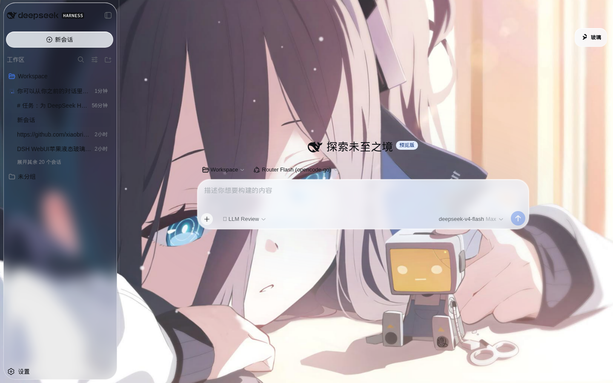
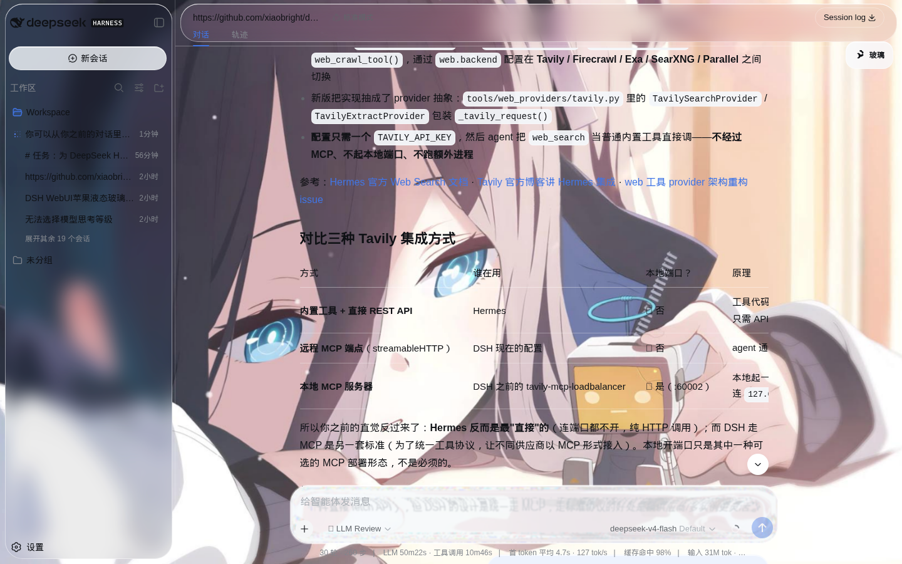
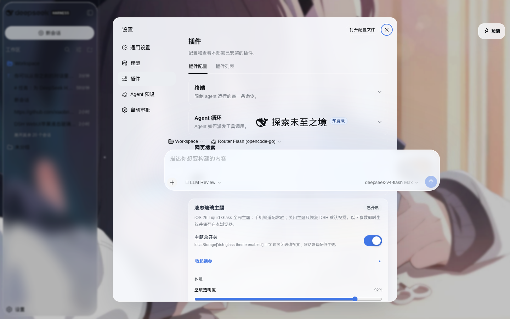

# dsh-glass-theme · DSH 液态玻璃主题（iOS 26 Liquid Glass）

> 在 DeepSeek Harness（DSH）WebUI 上实现 **iOS 26 Liquid Glass（液态玻璃）** 视觉风格的主题，
> 并包含**常驻手机端 UI 适配**。玻璃渲染方式参考 [`xingyingyuzhui/dsh-liquid-glass`](https://github.com/xingyingyuzhui/dsh-liquid-glass)。

- **壁纸层保持清晰**：背景插画作为静态壁纸（透明度可调），不再整图模糊；玻璃只糊在“玻璃岛”背后。
- **玻璃岛渲染**：侧栏 / 标题 / 输入卡 / 弹层各画一块 `::before` 玻璃板，局部 `backdrop-filter`。
- **SDF 位移折射**：按每个玻璃岛的实际尺寸生成圆角盒位移贴图，经 `feImage + feDisplacementMap`
  注入 SVG 滤镜做**真折射**（RGB 通道分离产生色散），参数（折射强度 / 圆角）可调。
- **手机端适配常驻**：单栏聊天、抽屉侧边栏、详情底部 Sheet、安全区、44px 触控、软键盘跟随，
  与玻璃视觉开关解耦。
- **设置分组可调**：外观 / 输入框 / 气泡 / 面板 分组折叠，不堆滑块。

## 截图

| 主界面（新会话） | 对话中的玻璃折射 | 设置页 |
| --- | --- | --- |
|  |  |  |

## 一、安装（web profile）

```bash
git clone https://github.com/czw63/dsh-glassmorphism.git
cd dsh-glassmorphism
node scripts/build.mjs      # 把 assets/background.jpg 内联进 lib/client.js

dsh plugin --profile web add "file:$(pwd)"
```

仓库自带 `cordis.patch.yml`（`dsh.bundle.patch`），`dsh plugin add` 时自动把 `glass-theme`
挂载进 bundle layer，**无需手动改 profile 的 cordis.patch.yml**。

重启并强刷：

```bash
systemctl restart dsh.service
# 浏览器打开 http://127.0.0.1:3080/ 后 Ctrl+F5
```

验证注入：

```bash
curl -s http://127.0.0.1:3080/ | grep -o '/plugins/@local/dsh-glass-theme/client.js[^"]*'
```

> 注意：pnpm `file:` 安装会把包**拷贝**到 profile 的 `node_modules`。改完源码后必须重新执行
> `node scripts/build.mjs`，并重新 `dsh plugin --profile web add "file:$(pwd)"`（或手动同步
> `node_modules/@local/dsh-glass-theme/lib/client.js`），然后重启服务。

## 二、卸载

```bash
dsh plugin --profile web remove @local/dsh-glass-theme
```

然后重启 `dsh web`，强刷后恢复 DSH 默认外观。

## 三、开关与设置

打开 **DSH 设置 → 插件 → 液态玻璃主题**：

- **主题总开关**：关闭后恢复 DSH 默认视觉；手机端布局适配不受影响。
- **输入框液态折射**：输入卡的 SDF 位移折射开关（仅作用于 backdrop，不位移输入文字）。
- **外观**：壁纸透明度、玻璃圆角、玻璃模糊半径、背景折射开关与强度。
- **输入框**：折射开关、模糊半径、透明度、折射强度。
- **消息气泡**：气泡玻璃化、模糊、透明度。
- **面板与弹层**：弹层模糊、面板透明度、侧边栏透明度、玻璃饱和度。

localStorage 快捷开关：

```js
localStorage['dsh-glass-theme:enabled'] = '0'    // 关闭玻璃视觉（手机适配仍在）
localStorage['dsh-glass-theme:input-lens'] = '0'  // 关闭输入框液态折射
```

所有参数也可通过 `localStorage['dsh-glass-theme:vars']` 覆盖 `--glass-*` CSS 变量（见
[`docs/TUNING.md`](docs/TUNING.md)），跨标签页实时同步。

## 四、渲染方式（技术说明）

| 层 | 实现 |
| --- | --- |
| 壁纸 | `assets/background.jpg` 构建期内联为 data URL，放固定层（`#dsh-glass-bg`），`filter: none` 保持清晰，`--glass-wallpaper-opacity` 调透明度 |
| 玻璃岛 | 侧栏 `.pI_x6G_sidebarCol::before`、标题 `.wSkVaW_header::before`、输入卡 `.uV2eYG_card::before`、弹层 `[role="menu"]` 等：`background` + `box-shadow` 内高光 + `backdrop-filter: blur() saturate()` |
| SDF 折射 | 每个玻璃岛按实际尺寸生成圆角盒位移贴图（`createIslandLensPixels`：SDF 圆角盒 + 穹顶梯度 + 边缘色散 + 高光），canvas → PNG data URL → `feImage`，`feDisplacementMap` 按 RGB 通道分离产生色散；同尺寸 + 同参数命中缓存 |
| 材质开关 | `body.dsh-glass-on`（主题开关）+ `data-dsh-glass-lens` / `data-dsh-glass-refract`（折射开关） |
| 主题适配 | 浅 / 深色两套 `--lg-*` / `--glass-*` 变量，深色用 `body[data-ds-dark-theme]` |

- 不移动 React DOM、不修改 DSH 源码；官方滚动 / sticky 所有权不改。
- `backdrop-filter` 只发生在各玻璃岛 `::before`，不糊壁纸、body 或官方滚动容器。

## 五、手机端适配（始终生效）

`<= 768px` 时：三栏变单栏；侧边栏成左侧抽屉、详情栏成底部 Sheet；安全区
`env(safe-area-inset-*)` + `100dvh` 动态视口（跟随 `visualViewport`，软键盘弹出输入框仍可见）；
常用控件 ≥ 44px 触控目标；设置页手机全屏 + 顶部横向导航。详情见
[`docs/MOBILE.md`](docs/MOBILE.md)。

## 六、性能

- 壁纸层静态；玻璃模糊只发生在各玻璃岛，不糊大区域。
- SDF 位移贴图按需生成（尺寸或参数变化时），同尺寸 + 同参数命中 LRU 缓存。
- 无逐帧动画、无滚动 / 尺寸轮询；`prefers-reduced-motion` 关闭全部动效。

## 七、项目角色与致谢

本主题由 **czw63 的 DeepSeek Harness** 开发与维护：

- **czw63**（项目作者）：确定需求方向（iOS 26 液态玻璃风格、常驻手机端适配、设置要详细但不堆滑块），
  并在多次迭代中把关与验收（包括安装验证与问题修复）。
- **AI 助手（运行在 czw63 的 DeepSeek Harness 中的 agent）**：负责整体实现——v2.0 的框架与手机端适配，
  以及 v2.1 的渲染方式重构（把玻璃渲染换成 dsh-liquid-glass 的方案）、设置整理、测试与文档编写。

**致谢**：玻璃渲染方式参考了 [`xingyingyuzhui/dsh-liquid-glass`](https://github.com/xingyingyuzhui/dsh-liquid-glass)
项目（壁纸层 + 玻璃岛局部 `backdrop-filter` + SDF 位移折射的实现思路），在此鸣谢其作者与开源贡献。
本项目在实现时保留了自身 v2 的移动端适配、设置 UI 与背景图方案，渲染层向其方案对齐。

## 八、License

MIT。更多实现细节见 [`docs/ARCHITECTURE.md`](docs/ARCHITECTURE.md)，调参见
[`docs/TUNING.md`](docs/TUNING.md)，手机端适配见 [`docs/MOBILE.md`](docs/MOBILE.md)。
